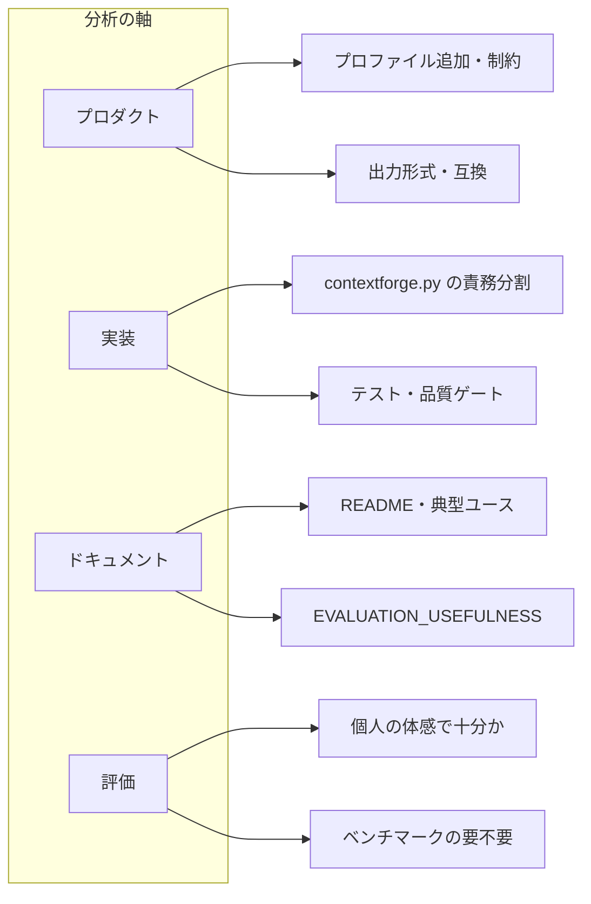

# 改善分析の枠組み

必要に応じてツールの改善を分析するときは、次の軸で見ると漏れが減ります。

## 分析の軸

## 見るべきポイント（要約）

- **プロダクト**: プロファイルでカバーすべきユースケースは足りているか。出力形式・サイズ制約は現実の LLM 制限に合っているか。
- **実装**: [contextforge.py](../contextforge.py) の単一ファイルのまま拡張し続けてよいか。Quality Gates（初回CLI成功、ZIP制約、秘密漏洩防止）が満たされているか。
- **ドキュメント**: README の「典型ユース」と実際の使い方がずれていないか。[EVALUATION_USEFULNESS.md](EVALUATION_USEFULNESS.md) の「個人は体感」が伝わっているか。
- **評価**: 現状「個人は体感」「公式はベンチマーク」で十分か。将来、コミュニティや Pro で数値を示すなら、正解データ・実行手順・集計をどこに置くか（別リポジトリ or `eval/` 等）。

## 使い方

上記 4 軸（プロダクト・実装・ドキュメント・評価）で「何が足りないか／何を変えたいか」をリストし、優先度を付けて改善分析する。

---

## 現状分析（プロダクト・実装）

以下は、プロダクト軸と実装軸についての現状の整理である。必要に応じて更新する。

### プロダクト

| 観点 | 現状 | 備考 |
|------|------|------|
| プロファイルでカバーすべきユースケース | 6 プロファイル（gemini-chronicle, claude-chronicle-30mb, claude-chronicle-30mb-fill, gemini-single-file, gpt5-zip, perplexity-prepare）。Gemini / Claude Web UI / GPT-5 / Perplexity 向けの「年代記ZIP」「単一ファイル」「標準ZIP」「チャンク準備」をカバー | Pro で言及されている audit / handover / security-review / refactor-review は OSS には未実装。必要ならプロファイル追加の検討 |
| 出力形式・サイズ制約と LLM 制限 | target_mb は 8.0〜80.0、max_single_mb は 1.8〜80.0。Perplexity 25MB・Claude 30MB・Gemini 約10MB 等をプロファイルで反映済み | 各ベンダーの制限変更時はプロファイルの target_mb / max_single_mb の見直しが必要 |

### 実装

| 観点 | 現状 | 備考 |
|------|------|------|
| 単一ファイルのまま拡張してよいか | contextforge.py は約 1,100 行。設定・収集・選択・出力・UI・CLI が一ファイルに同居 | 現状の機能規模では許容範囲。責務がさらに増える場合はモジュール分割を検討 |
| Quality Gates（初回CLI成功） | exports/ が無くても CLI は実行される（export_main_generator 内で output_dir / zip_path の親は mkdir(parents=True, exist_ok=True)）。PROJECT_PROFILE の「CLI run must succeed on first run even if exports/ does not exist」に合致 | 特に対応不要 |
| Quality Gates（ZIP制約） | 各プロファイルの target_mb 以内に収める best-effort の select_files と、超過時は heavy リストで除外。best-effort のため厳密な「超えたら失敗」はない | 仕様どおり。厳密制約が必要ならプロファイル or オプションで「超過時エラー」を検討可 |
| Quality Gates（秘密漏洩防止） | COMMON_EXCLUDE_FILES に `.env`, `*.env`, `*.pem`, `*.key`, `*.p12`, `*.pfx`, `*id_rsa*` を追加済み。ルート・サブディレクトリの .env および鍵類をデフォルト除外 | 対応済み |

### 次のアクション（例）

- 秘密漏洩防止: 対応済み（`.env`, `*.env`, `*.pem`, `*.key`, `*.p12`, `*.pfx`, `*id_rsa*` をデフォルト除外に追加）。
- プロファイル: 新規 LLM／新制限に対応するプロファイルを必要に応じて追加する。
- 単一ファイル: 行数・責務がさらに増えたタイミングで、設定・収集・出力・UI のモジュール分割を検討する。
